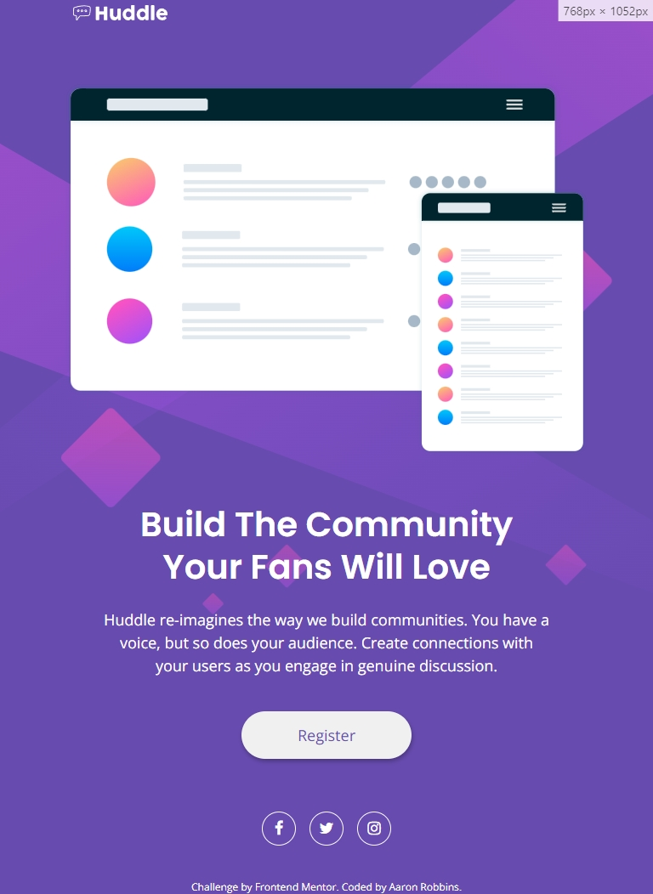
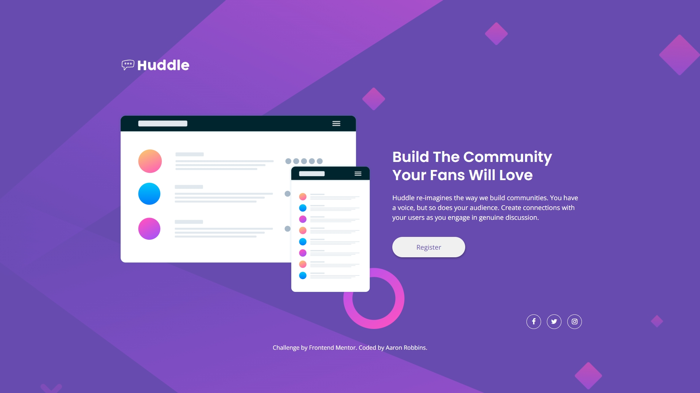

# Frontend Mentor - Huddle landing page with single introductory section solution

This is a solution to the [Huddle landing page with single introductory section challenge on Frontend Mentor](https://www.frontendmentor.io/challenges/huddle-landing-page-with-a-single-introductory-section-B_2Wvxgi0). Frontend Mentor challenges help you improve your coding skills by building realistic projects.

## Table of contents

- [Overview](#overview)
  - [The challenge](#the-challenge)
  - [Screenshot](#screenshot)
  - [Links](#links)
- [My process](#my-process)
  - [Built with](#built-with)
  - [What I learned](#what-i-learned)
  - [Continued development](#continued-development)
  - [Useful resources](#useful-resources)
  - [AI Collaboration](#ai-collaboration)
- [Author](#author)
- [Acknowledgments](#acknowledgments)

## Overview

### The challenge

Users should be able to:

- View the optimal layout for the page depending on their device's screen size
- See hover states for all interactive elements on the page

### Screenshot






### Links

- [Solution URL](https://your-solution-url.com)
- [Live Site URL](https://freexm1nd.github.io/huddle-landing-page/)

## My process

### Built with

- Semantic HTML5 markup
- CSS custom properties
- Flexbox
- Mobile-first workflow
- CSS Nesting
- [Font Awesome](https://fontawesome.com/v4/icons/) - For social media icons

### What I learned

This challenge required the use of social media icons as link buttons near the bottom of the page. W3 Schools had a great tutorial on how to implement these.

This challenge allowed me to continue learning how nesting works and how to make my code more concise.

I decided to revist clamp for this challenge so I can get used to using it in different situations. It came in handy for making responsive images between different media query breakpoints.

I continued honing my BEM skills here as well.

```html
<section aria-label="Social Media Links" class="landing__links">
  <a href="#" aria-label="Facebook icon" class="fa fa-facebook"></a>
  <a href="#" aria-label="Twitter icon" class="fa fa-twitter"></a>
  <a href="#" aria-label="Instagram icon" class="fa fa-instagram"></a>
</section>
```

```css
.landing__links {
  display: flex;
  justify-content: center;
  gap: var(--spacing-16);

  & .fa {
    display: flex;
    justify-content: center;
    align-items: center;
    text-decoration: none;
    color: white;
    border: 1px solid white;
    width: var(--mobile-social-border-size);
    height: var(--mobile-social-border-size);
    font-size: var(--mobile-social-icon-size);
    text-align: center;
    border-radius: 50%;
    &:hover {
      color: var(--pink-400);
      border: 1px solid var(--pink-400);
    }
  }
}
```

### Continued development

I want to continue learning about nesting and BEM. These still feel somewhat foreign to me and I don't think I've unlocked their full potential yet. I also want to continue using clamp in my projects. This was a fine project to use it on, but I think I can implement it better.

### Useful resources

- [Social Media Icons Tutorial](https://www.w3schools.com/howto/howto_css_social_media_buttons.asp) - This helped me create the social media icons needed for this challenge.
- [clamp() Calculator](https://www.marcbacon.com/tools/clamp-calculator/) - This is the calculator I used to get my clamp values.

### AI Collaboration

I used Claude in this challenge to assist in brainstorming solutions and to assist in debugging.

## Author

- GitHub - [Aaron Robbins](https://github.com/FREExM1ND)
- Frontend Mentor - [@FREExM1ND](https://www.frontendmentor.io/profile/FREExM1ND)

## Acknowledgments

Thanks to Font Awesome for providing the icons and W3 Schools for the tutorial on how to implement them.

I'm thankful for the team at Responsively for creating a useful development tool.

Thank you to Frontend Mentor for the challenge. I'm eager to do more.
